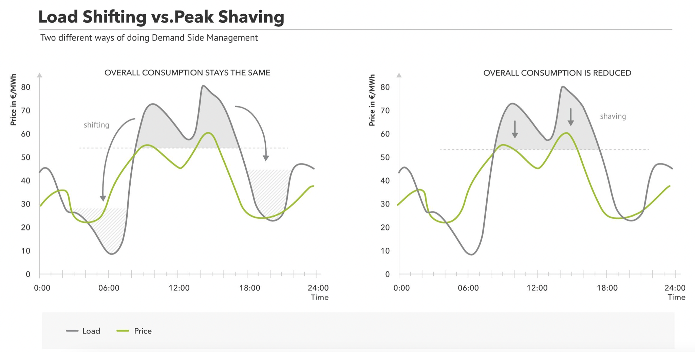
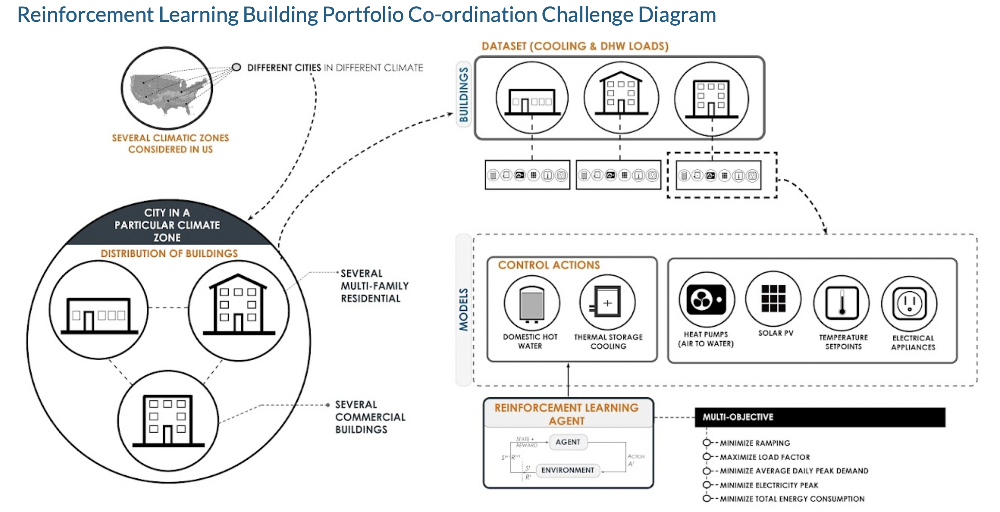

# Energy controlling in buildings 

- load shifting (shift certain power demand from e.g peak hour to off-peak hour of the day)
- use flexibility of certain components: 
    - battery, 
    - hot/chilled water storage, 
    - (the building itself as thermal storage: not applicable in this scenario, as the indoor temperature is set as a fix parameter)

## Demand-side-management: 
### Load-shifting vs peak-shifting

> source: https://www.next-kraftwerke.com/knowledge/what-is-peak-shaving

Flexible components in this scenario:
- temperature of the hot water storage: measured as SOC (state of charge)
- temperature of the chilled water storage
- battery SOC

## COP
Simplified relationship between COP and temperature

$$ COP_{\mathrm{c}} = {\eta}_{\mathrm{hp}} \cdot \frac{T^c_{\mathrm{target}}}{T_{\mathrm{outdoor,air}}-{T^c_{\mathrm{target}}}}
$$
with:
- ${\eta}_{\mathrm{hp}}=$ the efficiency of the heat pump, a 

## City challenge diagram

> source: https://sites.google.com/view/citylearnchallenge/previous-edition-2020

- multi-objective cost
    - minimize ramping
    - maximize load factor
    - minimize average daily peak demand
    - minimize electricity peak
    - minimize total energy consumption
- the cost function is normalized by a baseline model (with a rule-based controller, RBC model)
- the rule-based model (RBC)
    - charging of hot water storage and cold water storage by night, based only on hour of day
    - discharging by day
    - battery?

### Ramping

### Load factor

### Daily peak demand

### Electricity peak

### Total energy consumption